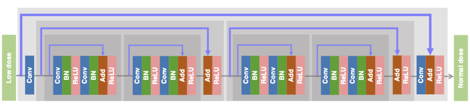
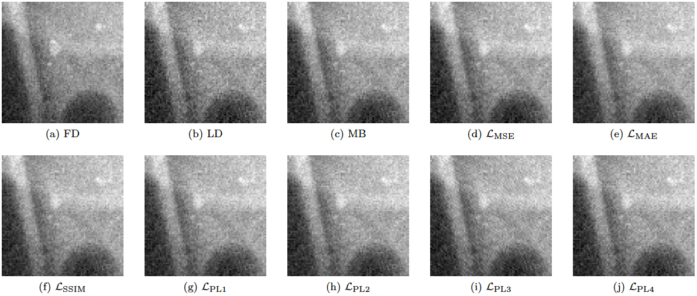
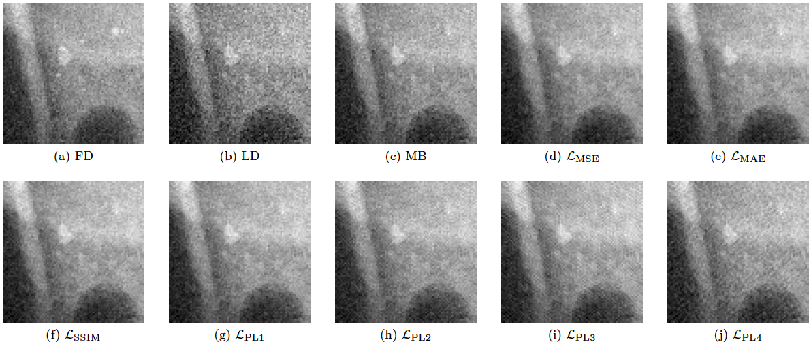

# Impact of loss functions on the performance of a deep neural network designed to restore low-dose digital mammography

======

This repository contains the training and testing codes for the paper "[Impact of loss functions on the performance of a deep neural network designed to restore low-dose digital mammography]()".

## Network architecture:

## Some results:

## Reference:

If you use the toolbox, we will be very grateful if you refer to this [paper]():

---
AI-based X-ray Imaging System ([AXIS](https://wang-axis.github.io))  
Department of Biomedical Engineering  
Rensselaer Polytechnic Institute  
Troy - USA  

Laboratory of Computer Vision ([Lavi](http://iris.sel.eesc.usp.br/lavi/))  
Department of Electrical and Computer Engineering  
São Carlos School of Engineering, University of São Paulo  
São Carlos - Brazil
